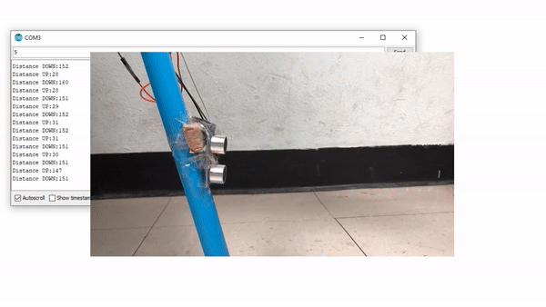
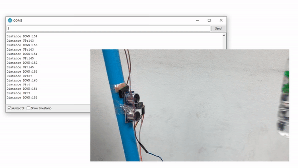

# :sound: What is Smart-Staff-Sensor ?
  ```Smart-Staff-Sensor``` —— ไม้เท้าอัจฉริยะที่จะช่วยให้ผู้พิการทางการมองเห็นสามารถใช้ชีวิตประจำวันได้อย่างสะดวกสบาย และมีความปลอดภัยมากขึ้น
 โดยภายในตัวไม้ของเรานั้นจะทำการติดเซนเซอร์ไว้โดยที่จะคอยตรวจจับวัตถุโดยรอบของตัวผู้ใช้ โดยจะส่งเสียงแจ้งเตือนเมื่อ
 * เข้าใกล้วัตถุในระยะน้อยกว่า 50 เซนติเมตร ตามแนวพื้น
 * เข้าใกล้วัตถุในระยะน้อยกว่า 150 เซนติเมตร ตามแนวขนานกับผู้ใช้

### 🔧 How to use ?
เมื่อมีวัตถุเข้ามาใกล้กับตัวsersonตัวล่างน้อยกว่า 50 เซนติเมตรจะมีเสียงแจ้งเตือนเพื่อให้ผู้พิการทางสายตาให้ระวังข้างหน้าพื้นแต่สามารถข้ามได้ เช่น ฟุตบาทหรือบันได<br>
<br>
เมื่อมีวัตถุเข้ามาใกล้กับตัวsersonตัวบนน้อยกว่า 150 เซนติเมตรจะมีเสียงแจ้งเตือนเพื่อให้ผู้พิการทางสายตาให้ระวังด้านหน้าที่เป็นแนวขนานผู้ใช้ เช่น กำแพงหรือคน<br>



## :video_camera: Poster & Video is Here!

#### Poster :camera: : 


### Video :movie_camera: :


 * We will show you with youtube [Clip Here](https://youtu.be/hkm7TtCkdAs)
  
## Parts of Smart-Staff-Sensor
  - [x] Node MCU V2 ESP8266
  - [x] Ultrasonic Sensor Module HC-SR04P 2 pieces
  - [x] Active Buzzer
  - [x] Jumper wires


## Our Members!
|<a href="img/numbar1"></a>|<a href=""></a>|<a href=""></a>|<a href=""></a>|
|:-------------:|:-------------:|:-------------:|:-------------:|
| 61070111      | 61070155      | 61070161      | 61070175      |
| Pathipol      | Pattaranan    | Pavaree       | Mongkhon      |
| [@DrSTHANKs]() | [@pythhh]() | [@Pavaree]() | [@mongkonpc]()  

## Assistance Teachers
|<a href="img/numbar1"></a>|<a href=""></a>|
|:---------------------:|:---------------------:|
|รศ.ดร.กิติ์สุชาต พสุภา     |รศ.ดร.ปานวิทย์ ธุวะนุติ |

>โปรเจคนี้เป็นส่วนหนึ่งของวิชา การการเขียนโค้ดและการสร้างโปรแกรมคอมพิวเตอร์พื้นฐาน COMPUTER PROGRAMMING (06016315)
หลักสูตรวิทยาศาสตร์บัณฑิต คณะเทคโนโลยีสารสนเทศ สาขาวิชาเทคโนโลยีสารสนเทศ
ภาคเรียนที่ 2 ปีการศึกษา 2561
สถาบันเทคโนโลยีพระจอมเกล้าเจ้าคุณทหารลาดกระบัง
