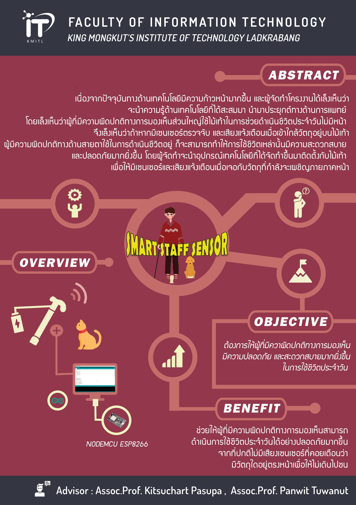

# Smart-Staff-Sensor
  บทนำจ้าบทนำบทนำ

## :page_with_curl: Our Poster!

### Result

  we will show you with youtube [Clip Here](https://youtu.be/hkm7TtCkdAs)
  
## Parts of Smart-Staff-Sensor
  - [x] Node MCU V2 ESP8266
  - [x] Ultrasonic Sensor Module HC-SR04P 2 pieces
  - [x] Active Buzzer
  - [x] Jumper wires

## Our Members!
|||||
|:-------------:|:-------------:|:-------------:|:-------------:|
| 61070111      | 61070155      | 61070161      | 61070175      |
| Pathipol      | Pattaranan    | Pavaree       | Mongkhon      |
| [@DrSTHANKs]() | [@pythhh]() | [@Pavaree]() | [@mongkonpc]()  

## Assistance Teachers
|||
|:---------------------:|:---------------------:|
|รศ.ดร.กิติ์สุชาต พสุภา     |รศ.ดร.ปานวิทย์ ธุวะนุติ |

